# ⚡ SKMTC Supabase Starter

**Ship typesafe Supabase apps at lightning speed** ⚡

Write your API once, get typesafe client and server code everywhere. No more manual type juggling, no more client-server sync headaches.

---

## 🎯 Perfect for Supabase developers who are tired of...

- ❌ **Writing the same types twice** (client + server)
- ❌ **Manually keeping APIs in sync** across frontend and backend
- ❌ **Boilerplate hell** for every new endpoint
- ❌ **Runtime type errors** that could have been caught at compile time
- ❌ **Context switching** between writing server logic and client queries

## ✨ What you get instead

- ✅ **Single source of truth** - Define your API once in TypeSpec
- ✅ **Full-stack type safety** - From database to UI components
- ✅ **Auto-generated everything** - Server handlers, client hooks, validation schemas
- ✅ **Modern stack** - React 19, Vite, TanStack Query, Supabase Edge Functions
- ✅ **Zero config** - Everything just works out of the box

## 🚀 Quick Start

### 1. Get the code
```bash
git clone https://github.com/your-username/skmtc-supabase-starter
cd skmtc-supabase-starter
pnpm install
```

### 2. Set up Supabase
```bash
# Add your Supabase credentials
cp .env.example .env.local
# Edit .env.local with your VITE_SUPABASE_URL and VITE_SUPABASE_ANON_KEY
```

### 3. Generate your first API
```bash
# Deploy generators (first time only)
pnpm run skmtc deploy

# Generate client and server code
pnpm run skmtc generate

# Start developing
pnpm run dev
```

### 4. See the magic ✨
Open `api/petstore-dogs.tsp` and see how a simple API definition becomes:
- 🎯 Typesafe React Query hooks in your frontend
- 🛡️ Zod validation schemas 
- ⚡ Hono-powered Supabase Edge Functions
- 📝 Full TypeScript types everywhere

## 🏗️ How it works

```mermaid
graph LR
    A[📝 TypeSpec API] --> B[🔧 SKMTC Generator]
    B --> C[⚛️ React Hooks]
    B --> D[🛡️ Zod Schemas]
    B --> E[⚡ Supabase Functions]
    B --> F[📋 TypeScript Types]
```



1. **Define once** - Write your API in TypeSpec (like OpenAPI, but better)
2. **Generate everywhere** - SKMTC creates typesafe code for client and server
3. **Ship fast** - No manual sync, no runtime errors, just pure productivity

## 📦 What's included

### Frontend Stack
- **React 19** - Latest React with concurrent features
- **Vite** - Lightning fast dev server and builds  
- **TanStack Query** - Powerful data fetching (auto-generated hooks!)
- **TypeScript** - Full type safety from API to components

### Backend Stack  
- **Supabase** - Database, auth, and hosting
- **Hono** - Fast web framework for Edge Functions
- **Zod** - Runtime type validation (auto-generated schemas!)

### Developer Experience
- **Hot reload** - Changes appear instantly
- **Type safety** - Catch errors at compile time
- **Auto-completion** - Perfect IntelliSense everywhere
- **ESLint + Prettier** - Consistent, beautiful code

## 🎮 Try it yourself

1. **Edit an API** - Open `api/petstore-dogs.tsp` and add a new endpoint
2. **Regenerate** - Run `pnpm run skmtc generate` 
3. **Use it** - Import the generated hook in your React component
4. **Deploy** - Push to Supabase and you're live!

## 🔍 Example: Adding a new endpoint

**1. Define in TypeSpec:**
```typescript
// api/petstore-dogs.tsp
@get
@route("/dogs/{id}")
op getDog(@path id: string): Dog | NotFound;
```

**2. Generate code:**
```bash
pnpm run skmtc generate
```

**3. Use in React:**
```tsx
// Automatically generated and typesafe!
import { useGetDog } from './generated.hooks'

function DogProfile({ dogId }: { dogId: string }) {
  const { data: dog, isLoading } = useGetDog({ id: dogId })
  // `dog` is fully typed as Dog | undefined
  return <div>{dog?.name}</div>
}
```

**4. Server handles it automatically** - The Supabase Edge Function is generated and deployed!

## 🛟 Getting help

- 📚 [SKMTC Documentation](https://skmtc.dev/docs)
- 💬 [GitHub Discussions](https://github.com/skmtc/skmtc/discussions)
- 🐛 [Report Issues](https://github.com/your-username/skmtc-supabase-starter/issues)

## 📄 License

MIT License - build amazing things! 🚀

---

**Ready to ship faster?** ⭐ Star this repo and start building your next Supabase app with confidence!